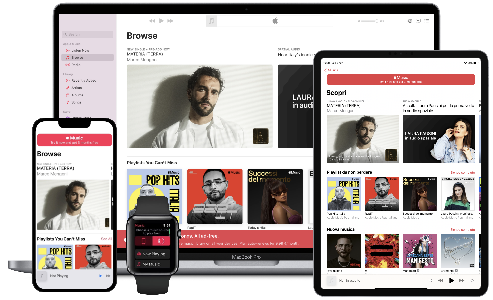

<div align="center">
  <h3>Lab</h3>
  <h1>Make it Multiplatform</h1>
  <br />
  <a href="https://github.com/developer-academy-unina/Lab-Make-it-Multiplatform/issues/new?assignees=&labels=bug&template=01_BUG_REPORT.md&title=bug%3A+">Report a Bug</a>
  ·
  <a href="https://github.com/developer-academy-unina/Lab-Make-it-Multiplatform/discussions">Ask a Question</a>
  
</div>
  <br />
<p align="center">
  <a href="#" alt="Version">
    
  </a>
  <a href="#" alt="XCode Version">
    
  </a>        
  <a href="#" alt="Swift Version">
    
  </a>
  <a href="#" alt="Framework used">
    
  </a>          
</p>

<details open="open">
<summary>Table of Contents</summary>

- [About](#about)
- [Getting Started](#getting-started)
  - [Installation](#installation)
  - [How to](#how-to)
- [Issues and Discussions](#issues-and-discussions)
- [Support](#support)
- [Authors & contributors](#authors--contributors)
- [License](#license)

</details>

---
<br />

## About

Creating a Multiplatform App isn't always as immediate as it sounds. Here is an activity you can start from to learn the development techniques you can use when you first initialize your project to make every Apple device support it. There are different strategies that can also be merged to reach our goal: starting from the Multiplatform Template initialization, passing through individually adding Development Targets having their Platform Scoped Files, to Sharing Common Files dealing with incompatibility conflicts using Conditional Compilation Blocks. Furthermore, if an iOS project has been already developed and has to be brought to macOS, Mac Catalyst can also be an option.

You should have some preliminary knowledge about SwiftUI and Design Principles for all Platforms to be able to go through this activity.

By the end of the activity, you should be acquainted with using the Multiplatform Template, along with setting new Development Targets and managing Shared Common files' incompatibility conflicts using Conditional Compilation Blocks.

<summary>Screenshots</summary>
<br>

|                               Make it Multiplatform App                               |
| :-------------------------------------------------------------------: |
|  |

<br />

## Getting Started

### Installation

1. Clone the repo

   ```sh
   git clone https://github.com/developer-academy-unina/Lab-Make-it-Multiplatform
   ```

2. Open the ```.xcodeproj``` file

### How to

1. Multiplatform Music App (Starter)

The Multiplatform Template can be useful to set your app with a very powerful structure supported by different devices. In this activity you will move your first steps to master its concept.

- Here you will understand how to create an app architecture for all platforms.
- What Platform Scoped Files are and how they're helping build views that can't be shared among all the platforms.
- How to Share Common Files among different platforms taking incompatibility conflicts into account.
- How to use Conditional Compilation Blocks to avoid incompatibility conflicts in Shared Common Files.
- How to programmatically detect the device.
- How to use each device's simulator.
- Which frameworks and iOS exclusive functionalities are not supported by specific devices.

2. Multiplatform Music App (Final)

This is the final result of the Multiplatform Music App with all the development targets including the WatchOS App, using Conditional Compilation Blocks for Shared Common Files.

<br />

## Issues and Discussions

You've found a bug in the source code, a mistake in the documentation or maybe you'd like a new feature? Take a look at [GitHub Discussions](https://github.com/developer-academy-unina/Lab-Make-it-Multiplatform/discussions) to see if it's already being discussed. You can help us by [submitting an issue on GitHub](https://github.com/developer-academy-unina/Lab-Make-it-Multiplatform/issues). Before you create an issue, make sure to search the issue archive -- your issue may have already been addressed!

Please try to create bug reports that are:

- _Reproducible._ Include steps to reproduce the problem.
- _Specific._ Include as much detail as possible: which version, what environment, etc.
- _Unique._ Do not duplicate existing opened issues.
- _Scoped to a Single Bug._ One bug per report.

<br />

## Support

Reach out to the maintainer at one of the following places:

- [GitHub Discussions](https://github.com/developer-academy-unina/Lab-Make-it-Multiplatform/discussions)
- [GitHub issues](https://github.com/developer-academy-unina/Lab-Make-it-Multiplatform/issues/new?assignees=&labels=question&template=04_SUPPORT_QUESTION.md&title=support%3A+)
- Contact a Mentor for any other help

<br />

## Authors & contributors

The original setup of this repository is by [Luca Palmese](https://github.com/pal-luke).

For a full list of all authors and contributors, see [the contributors page](https://github.com/developer-academy-unina/Lab-Make-it-Multiplatform/contributors).

<br />

## License

This project is licensed under the **MIT License**.

See [LICENSE](LICENSE) for more information.
